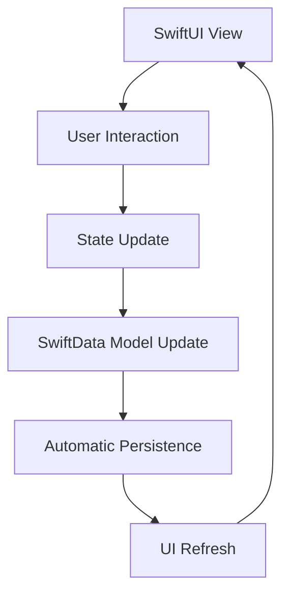

# Design Document

## Overview

This design document outlines the systematic overhaul of core functionality in the health and fitness iOS application. The application is built using SwiftUI with SwiftData for persistence, and follows a modern iOS architecture pattern. The overhaul focuses on four key areas: Weight Tracker CSV functionality, auto-saving Journal with tag interactions, a completely rebuilt Supplements tracker, and Exercise Library population.

The design emphasizes automatic data persistence, seamless user experience, and robust error handling while maintaining the existing application architecture and design patterns.

## Architecture

### Current Architecture Analysis

The application follows a standard SwiftUI + SwiftData architecture:

- **SwiftUI Views**: Declarative UI components with state management
- **SwiftData Models**: Core Data successor for object persistence
- **Model Container**: Centralized data container with autosave enabled
- **Environment Integration**: ModelContext passed through SwiftUI environment
- **HealthKit Integration**: Existing HealthKitManager for health data sync

### Data Flow Pattern



### Key Architectural Principles

1. **Immediate Persistence**: All user interactions result in immediate SwiftData saves
2. **State Restoration**: Views automatically restore state from persisted data
3. **Single Source of Truth**: SwiftData models serve as the authoritative data source
4. **Error Resilience**: Graceful handling of persistence and import/export failures

## Components and Interfaces

### 1. Weight Tracker Enhancement

#### CSV Export Component
```swift
protocol WeightDataExporter {
    func exportWeightDataToCSV() -> Result<URL, WeightExportError>
}

class WeightCSVExporter: WeightDataExporter {
    private let modelContext: ModelContext
    private let dateFormatter: DateFormatter
    
    func exportWeightDataToCSV() -> Result<URL, WeightExportError>
}
```

#### CSV Import Component
```swift
protocol WeightDataImporter {
    func importWeightDataFromCSV(url: URL) -> Result<Int, WeightImportError>
}

class WeightCSVImporter: WeightDataImporter {
    private let modelContext: ModelContext
    
    func importWeightDataFromCSV(url: URL) -> Result<Int, WeightImportError>
}
```

#### Enhanced WeightTrackerView
- Maintains existing UI structure
- Adds CSV export/import functionality to toolbar menu
- Implements duplicate detection during import
- Provides user feedback for import/export operations

### 2. Auto-Saving Journal System

#### Journal Tag Management
```swift
enum JournalTag: String, CaseIterable {
    case coffee, alcohol, caffeine, lateEating, stress, exercise
    case meditation, goodSleep, poorSleep, illness, travel
    case work, social, supplements, hydration, mood, energy, focus, recovery
    
    var displayName: String { /* localized display name */ }
    var icon: String { /* SF Symbol name */ }
    var color: Color { /* associated color */ }
}
```

#### Enhanced DailyJournal Model
The existing DailyJournal model will be refactored to support:
- Dynamic tag array instead of individual boolean properties
- Computed properties for backward compatibility
- Automatic date normalization for consistent querying

#### Auto-Save Journal View
```swift
struct JournalView: View {
    @Environment(\.modelContext) private var modelContext
    @State private var selectedDate = Date()
    @State private var selectedTags: Set<JournalTag> = []
    @State private var notes: String = ""
    
    private func toggleTag(_ tag: JournalTag) {
        // Immediate UI update + persistence
    }
    
    private func loadEntryForDate() {
        // Query and restore state for selected date
    }
}
```

### 3. Rebuilt Supplements Tracker

#### New Data Models

```swift
@Model
final class Supplement {
    var id: UUID
    var name: String
    var timeOfDay: String // "Morning" or "Evening"
    var dosage: String
    var isActive: Bool
    
    init(name: String, timeOfDay: String, dosage: String)
}

@Model
final class SupplementLog {
    var id: UUID
    var date: Date
    var supplementName: String
    var isTaken: Bool
    
    init(date: Date, supplementName: String, isTaken: Bool = false)
}
```

#### Supplement Data Seeder
```swift
class SupplementDataSeeder {
    static func seedDefaultSupplements(modelContext: ModelContext) {
        // Check if supplements already exist
        // Create morning and evening supplement stacks
        // Save to SwiftData
    }
}
```

#### SupplementTrackerView Architecture
```swift
struct SupplementTrackerView: View {
    @Environment(\.modelContext) private var modelContext
    @Query private var supplements: [Supplement]
    @State private var selectedDate = Date()
    @State private var supplementLogs: [String: Bool] = [:]
    
    private var morningSupplements: [Supplement] { /* filtered supplements */ }
    private var eveningSupplements: [Supplement] { /* filtered supplements */ }
    
    private func toggleSupplement(_ supplement: Supplement) {
        // Immediate persistence logic
    }
    
    private func loadSupplementLogs() {
        // Query and restore state for selected date
    }
}
```

### 4. Exercise Library Population

#### Exercise Data Seeder
```swift
class ExerciseDataSeeder {
    static func seedExerciseLibrary(modelContext: ModelContext) {
        // Check if exercises already exist
        // Create comprehensive exercise database
        // Organize by muscle groups
        // Save to SwiftData
    }
    
    private static func createExercisesForMuscleGroup(_ group: MuscleGroup) -> [ExerciseDefinition]
}
```

#### Integration with App Launch
The seeding will be integrated into the existing app launch sequence in `workApp.swift`:

```swift
private func seedDataIfNeeded() {
    // Check and seed supplements
    // Check and seed exercises
    // Maintain existing seeding logic
}
```

## Data Models

### Enhanced DailyJournal Model

The existing DailyJournal model will be refactored to support dynamic tags while maintaining backward compatibility:

```swift
@Model
final class DailyJournal {
    // Existing properties maintained for compatibility
    var id: UUID
    var date: Date
    var notes: String?
    
    // New dynamic tag system
    var tagData: Data? // Encoded Set<String>
    
    // Computed property for tag access
    var tags: Set<String> {
        get {
            guard let data = tagData else { return [] }
            return (try? JSONDecoder().decode(Set<String>.self, from: data)) ?? []
        }
        set {
            tagData = try? JSONEncoder().encode(newValue)
            updateLegacyProperties(from: newValue)
        }
    }
    
    // Legacy boolean properties for backward compatibility
    var consumedAlcohol: Bool = false
    var caffeineAfter2PM: Bool = false
    // ... other existing properties
    
    private func updateLegacyProperties(from tags: Set<String>) {
        // Update boolean flags based on tags for compatibility
    }
}
```

### New Supplement Models

```swift
@Model
final class Supplement {
    var id: UUID = UUID()
    var name: String
    var timeOfDay: String // "Morning" or "Evening"
    var dosage: String
    var isActive: Bool = true
    var sortOrder: Int = 0
    
    init(name: String, timeOfDay: String, dosage: String, sortOrder: Int = 0) {
        self.name = name
        self.timeOfDay = timeOfDay
        self.dosage = dosage
        self.sortOrder = sortOrder
    }
}

@Model
final class SupplementLog {
    var id: UUID = UUID()
    var date: Date
    var supplementName: String
    var isTaken: Bool
    var timestamp: Date = Date()
    
    init(date: Date, supplementName: String, isTaken: Bool = false) {
        self.date = Calendar.current.startOfDay(for: date)
        self.supplementName = supplementName
        self.isTaken = isTaken
    }
}
```

### Model Container Updates

The existing model container in `workApp.swift` will be updated to include new models:

```swift
.modelContainer(for: [
    // Existing models
    UserProfile.self,
    WorkoutSession.self,
    CompletedExercise.self,
    WorkoutSet.self,
    ExerciseDefinition.self,
    Program.self,
    WeightEntry.self,
    DailyJournal.self,
    // New models
    Supplement.self,
    SupplementLog.self
], isAutosaveEnabled: true, isUndoEnabled: false)
```

## Error Handling

### CSV Import/Export Errors

```swift
enum WeightExportError: LocalizedError {
    case noData
    case fileCreationFailed
    case shareSheetFailed
    
    var errorDescription: String? { /* localized descriptions */ }
}

enum WeightImportError: LocalizedError {
    case fileReadFailed
    case invalidFormat
    case parsingFailed(line: Int)
    case saveFailed
    
    var errorDescription: String? { /* localized descriptions */ }
}
```

### Data Persistence Errors

```swift
enum PersistenceError: LocalizedError {
    case contextSaveFailed(Error)
    case modelCreationFailed
    case queryFailed(Error)
    
    var errorDescription: String? { /* localized descriptions */ }
}
```

### Error Handling Strategy

1. **Graceful Degradation**: App continues to function even if specific operations fail
2. **User Feedback**: Clear, actionable error messages presented to users
3. **Logging**: Comprehensive error logging for debugging
4. **Recovery Options**: Where possible, provide users with recovery actions

## Testing Strategy

### Unit Testing

1. **Data Model Tests**
   - Test SwiftData model creation and relationships
   - Validate data persistence and retrieval
   - Test model migrations and compatibility

2. **Business Logic Tests**
   - CSV import/export functionality
   - Tag toggle and persistence logic
   - Supplement logging operations
   - Exercise seeding logic

3. **Error Handling Tests**
   - Invalid CSV format handling
   - Network failure scenarios
   - Data corruption recovery

### Integration Testing

1. **SwiftData Integration**
   - Test model container setup
   - Validate query performance
   - Test concurrent access scenarios

2. **UI Integration**
   - Test state restoration across view changes
   - Validate immediate persistence behavior
   - Test date navigation and data loading

### User Acceptance Testing

1. **Auto-Save Functionality**
   - Verify immediate persistence of user actions
   - Test state restoration after app restart
   - Validate data consistency across date changes

2. **Import/Export Workflows**
   - Test CSV export with various data sets
   - Validate import with different CSV formats
   - Test duplicate handling during import

3. **Supplement Tracking**
   - Test supplement logging across different dates
   - Verify state persistence and restoration
   - Test supplement stack management

## Performance Considerations

### Data Loading Optimization

1. **Lazy Loading**: Use SwiftUI's lazy containers for large data sets
2. **Query Optimization**: Implement efficient SwiftData queries with proper predicates
3. **Background Processing**: Perform heavy operations (CSV processing) on background queues

### Memory Management

1. **Model Lifecycle**: Proper SwiftData model lifecycle management
2. **View State**: Minimize retained state in views
3. **Resource Cleanup**: Proper cleanup of temporary files and resources

### User Experience

1. **Immediate Feedback**: Visual feedback for all user interactions
2. **Loading States**: Appropriate loading indicators for async operations
3. **Smooth Animations**: Maintain 60fps during state transitions

## Security and Privacy

### Data Protection

1. **Local Storage**: All data stored locally using SwiftData encryption
2. **Export Security**: Temporary files cleaned up after export operations
3. **Import Validation**: Strict validation of imported data to prevent injection

### Privacy Compliance

1. **HealthKit Integration**: Proper authorization and data handling
2. **User Consent**: Clear communication about data usage
3. **Data Minimization**: Only collect and store necessary data

## Migration Strategy

### Backward Compatibility

1. **Model Evolution**: Use SwiftData's migration capabilities for model changes
2. **Legacy Support**: Maintain compatibility with existing DailyJournal boolean properties
3. **Gradual Migration**: Migrate existing data to new tag system over time

### Deployment Strategy

1. **Feature Flags**: Implement feature toggles for gradual rollout
2. **Rollback Plan**: Ability to revert to previous data structures if needed
3. **Data Validation**: Comprehensive validation during migration process